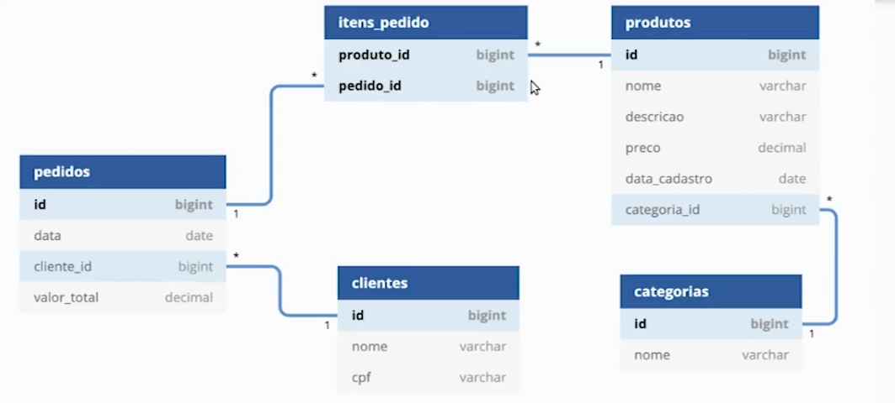

# Java e JPA: consultas avançadas, performance e modelos complexos

## Aula 1: Mais relacionamentos

- A mapear novas entidades na aplicação conforme a modelagem do banco de dados;
- A mapear um relacionamento com cardinalidade muitos-para-muitos;
- A mapear um relacionamento bidirecional;
- Como persistir entidades que possuam relacionamentos bidirecionais.

### Aula 2: Boas Práticas

- Inicializar propriedades do tipo lista

```
private List<ItemPedido> itens = new ArrayList();
```
- Em relacionamentos muitos x muitos, os dois lados precisam se conhecerem. Desta forma, partindo do exemplo utilizado, criamos um método utilitário que vincula os dois lados do relacionamento.

```
public void adicionarItem(ItemPedido item){
    item.setPedido(this);
    this.itens.add(item);
}
```
- No exemplo utilizado, o valor do produto em ItemPedido, poderá ser passado logo no construtor.
- `cascade = CascadeType.ALL`, utilizado no Pedido para refletir em ItemPedido inserts, deletes, etc. Pois nesse caso, não teria sentido ter um pedido sem itens e nem itens sem pedido.  



## Aula 3: Consultas avançadas

- A realizar consultas utilizando funções de agregação, tais como min, max, avg e sum;
- Como escrever consultas de relatórios utilizando JPQL;
- Como utilizar o recurso select new em consultas JPQL;
- A realizar consultas utilizando named queries.

## Aula 4: Performance de

- Como funcionam as estratégias EAGER e LAZY, em consultas de entidades que possuem relacionamentos;
- Por que a JPA pode lançar a exception LazyInitializationException em determinadas situações;
- As boas práticas no carregamento de entidades com relacionamentos;
- Como realizar consultas planejadas com o recurso join fetch.

## Aula 5: Criteria API

- Como realizar consultas JPQL com parâmetros opcionais;
- Como funciona a Criteria API da JPA;
- Como realizar uma consulta com parâmetros opcionais via Criteria API.

## Outros tópicos 

- A utilizar as anotações @Embeddable e @Embedded para organizar o código de uma entidade;
- A realizar herança entre entidades com as estratégias SINGLE_TABLE e JOINED;
- Como mapear uma chave composta com a anotação @EmbeddedId.